# Hi, welcome to my page.
Here you get to know me and see some of my open projects! 
Want to reach out, email me @ skdarkey@gmail.com.

## Core Competencies 
* #### Machine Learning Engineering [AWS Certified Specialist](https://www.credly.com/badges/31331771-9fca-4a3f-8bd7-72f40f5d3913/public_url)
* #### Spatial Data Science

## Technologies: 
- **Core**: Python, SQL, Spark, PostgreSQL, Scikit-learn, Tensorflow, Pytorch, MLFlow, Microsoft Azure, AWS, Databricks, ArcGIS Pro, QGIS, GDAL.   
- **Proficient**: HTML, CSS, JavaScript, NodeJS, Git, Github, Docker, Kubernetes, SAS.

## Education
- PhD - CDT Environmental Intelligence - University of Exeter (Sept. 2024 - Present).
- MSc Photogrammetry and Geoinformatics - Stuttgart Technology University of Applied Sciences, Germany (Sept. 2022- Feb. 2024).

[Other relevant courses completed](https://drive.google.com/file/d/1XITClVEXs65wSQ_GCgq-y1CT8l9H8U9q/view?usp=sharing).

## Work Experience.
**Geospatial Data Scientist – Allianz SE Global Data & AI team – March 2024 – August 2024.**
-	Created ETL pipelines to automatically download image data from wms server for portfolio buildings in France into ADLS Gen2 storage.
-	Assisting in predictive models’ development for property features estimation.
-	Developed and improved Python workflows for property feature extraction.
-	reduced processing time from 4hrs to 4 minutes in one case.
- Collaborated with cross-functional teams and stakeholders for requirements engineering and solutions development.
- Collaborated with technical team for code reviews.

**Geo-Data Analyst – Allianz SE Global Data & AI team  – Sept. 2023 – March 2024.**
- Developed and maintained geospatial data pipelines to process geodata at scale.
- Developed workflows with Python to extract property features from remote sensing data to improve portfolio property risk scoring and premium pricing.
- Created additional annual gain of about 0.8% on $400m insurance portfolio.
- Collaborated with cross-functional teams and stakeholders for requirements engineering and solutions development.

**Co-founder and Business Lead @ Nukushare Agro Limited (March 2020 – July 2022)**
- Analysed remote sensing Data for Crop risk scoring and farmer-credit management.
- Planned and Directed Agricultural Input Credit Insurance Initiative in Ghana.
- Coordinating research into Climate Risk Mitigation and Adaptation measures in the agriculture sector of Ghana.

# Some Recent Open Projects:

### 1. Live Population Dashboard project (Geospatial Data Science & Automation):
In this project, working together in a team of three to produce 3 different dashboards, 
- I used *Python* to scrape Baden-Wurttemberg population and migration statistic data,
- I used Python to download OpenStreetMap geo data for Stuttgart City(includes land use data and building footprints).
- Data cleaning and transformation were performed using python.
- *PostgreSQL* database was designed to store data and *SQLAlchemy* and *psycopg* were used in writing data to db.
- Data transformation and analysis was done in ArcGIS Pro GIS desktop software.
- A live dashboard was created to visualize the patterns in the data using ArcGIS Online.
- A regression model was used to learn the pattern of population growth and to project the population of Stuttgart City and the Stuttgart administrative area by 2040.
- The workflow was automated to enable any update on the Baden-Wuerttemberg Statistic [**site**](https://www.statistik-bw.de/) to reflect in the dashboard. 
A short video on the project can be seen here. [**Video**](https://youtu.be/H-GCY9xvKJI).
The code for this project can be found here [**Notebook**](https://github.com/skdarkey/portfolio/blob/main/Population%20Dashboard%20Codebase.ipynb)

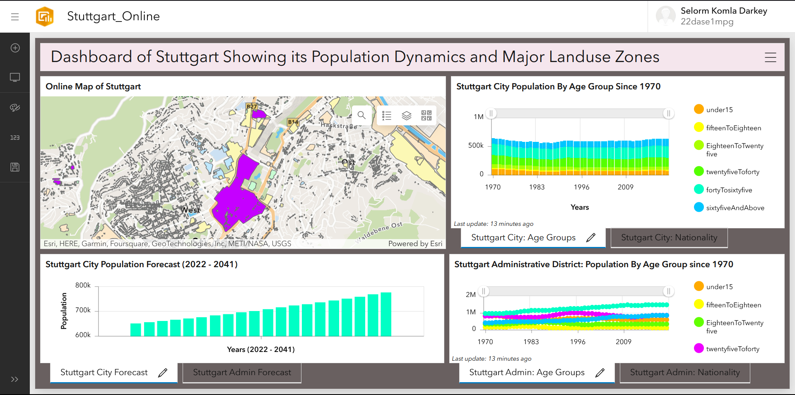

### 2. 3D Settlement Growth Analytics, Change Detection and Visualization (Geo Data Science):
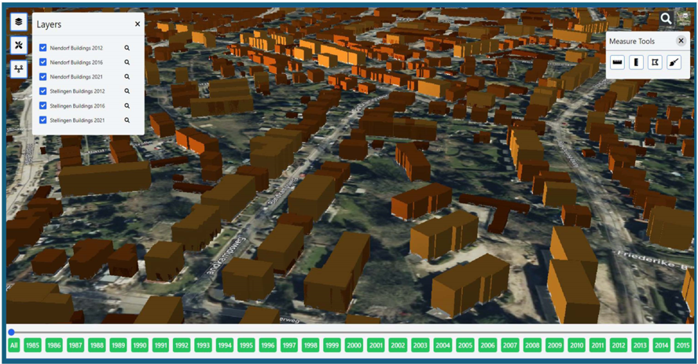  
In this project, I created a robust methodology and a web application for settlement growth analysis, change detection, and visualization in 3D. 
- I used the open-source World Settlement Footprint (raster data) and Citygml datasets of Stellingen and Niendorf in Germany,
- Python geospatial libraries, *Safe FME*, *QGIS*, and *Cesium*, *HTML*, *JavaScript* and *CSS* technologies,
- to create a robust data processing pipelines and a 3D visualization application for the 2 cities in Germany.
- This application can be scaled and used to analyze and visualize the evolution of any city with ease.
A short video on the project can be seen here: [**Video**](https://youtu.be/43EBbHRRL2c).

### 3. Tree Instances Detection and Segmentation from Satellite Imagery. 
-  I downloaded Satellite images of the AOI.
-  I manually annotated the trees in the image chips to create a training dataset.
-  I developed and trained a Masked R-CNN model for tree instances segmentation, achieving a precision of 0.79 and recall of 0.70.
-  I fine-tune YOLOv11 model on the dataset and compared metrics and inference results.
-  I post-processed the inference results into a fully ready tree-crowns dataset with over 1 million trees across UK.

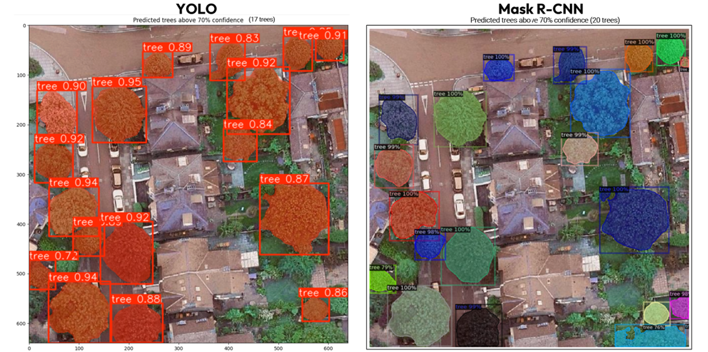
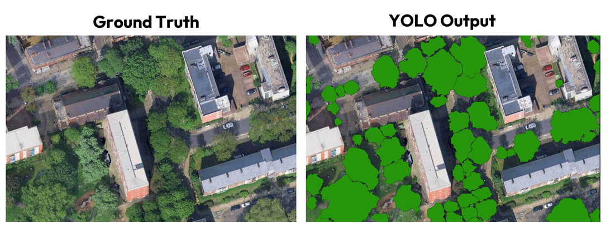
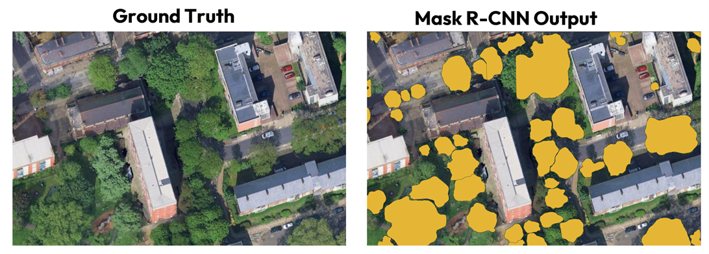

### 4. Computer Vision Object Detection -- Solar Panels Extraction from Satellite Imagery. 
Using Pytorch and YOLOv8 model, I trained an object detection model to detect and extract relevant properties of solar panels in satellite images.
-  2546 TIF images from Germany provided by Maxar Technologies.
-  60 : 20 : 20: training, validation and testing datasets.
-  I detected solar panels, extracted and projected them to their real world coordinates, and measured their sizes.
-  Precision of 0.5 and Recall of 0.3.

Summary and Challenges faced: 
-  Training was cut short due to usage of google colab and limited compute.
-  Inference was very fast and ground-truth checks were mostly accurate.

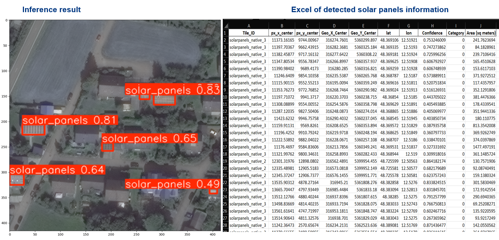
- [**Excel Sheet for all solar panel properties extracted**](predicted_solar_panel.xlsx)

### 5. Computer Vision Image Classification -- Clothing Images classification.
Using TensorFlow Deep Learning library and Python, I built CNN image classification models in attempt to classify images of different items of clothings.

- No. of unique classes to classify 10
- Training data : 60,000 images
- Testing data : 10,000 images
- Image Size: 28x28 grayscale images.
- Dataset Source: Tensorflow Fashion MNIST dataset.
  
Brief Summary: I built 3 different neural network classification models and compared their accuracy on the testing data. The best performing model achieved an accurary of 80%. Through the confusion matrix computed, it was observed that images of few classes such as T-shirt and Pullover were the most misclassified since their images tend to look quite familiar. 
[**The Notebook can be found here**](https://colab.research.google.com/drive/1i6y2JXadmIrjE873T11gfYiIgEAa6FgL)  
 

### 6. House Price Prediction project (Data Science & Machine Learning):
In this project, I used Python libraries Pandas, NumPy, Seaborn, Plotly, Matplotlib, and Scikit-learn to analyze the Boston city house pricing dataset.
- I started with exploratory data analysis.
- Built a regression model to help predict the prices of new homes.
- Used log transform to improve the distribution of the dataset.
- Built the model again which is able to predict with 79% accuracy. 
[**House Price Prediction Notebook**](https://colab.research.google.com/drive/1OOQvevXED8NoMMzUQfUndf0gVJGpq5Yi). 
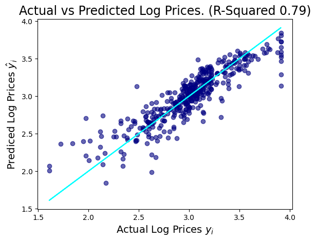

### 7. Google Play Store App Analytics (Goal: Machine Learning Task from Development to Deployment on AWS).
In this project, I did a comprehensive analysis of the Android app market by comparing thousands of apps in the Android Play store. Using Python libraries Pandas and Plotly, I analyzed the app market with the goal of answering the questions:
- which apps have the highest downloads?
- what categories of apps are most downloaded?
- what is the revenue potential for a paid app?
- which categories and content type for paid apps make them sell?

I then developed machine learning regression models to predict the potential number of downloads an app can get based on its category, type, content rating, price and size. I used Scikit-learn for model development, MLFlow for experiment tracking and selection of best most, Flask and Docker for packaging the model as an application, and AWS ECS for deploying the application as a web service. 

The overall goal was to develop an app pricing and revenue forecasting mechanism to make data-informed decisions in pricing and categorizing new apps to ensure their success in the Android app market.  

**The projects GitHub repo can also be seen** [**here**](https://github.com/skdarkey/andriod-apps-ml-project).

### 8. Image Classification project -- Food Images -- (Deep Learning, Computer Vision & Transfer Learning).
In this project, I build CNN models to classify 10 classes of food. The best results achieved was 41% validation accuracy from three CNN models I built from scratch, even after augmenting the data. So I used Transfer learning feature extraction, where I used Resnet50 and EfficientnetB0 architectures to improve the classification to finally realise a validation accuracy of 91% without overfitting.
Dataset include: 10 classes of food extracted from the Food101 Kaggle dataset.
[**The Notebook can be seen here**](https://colab.research.google.com/drive/1KvDgqY_AbeXMGU4wDhzV2OwbzC0zjNG3)

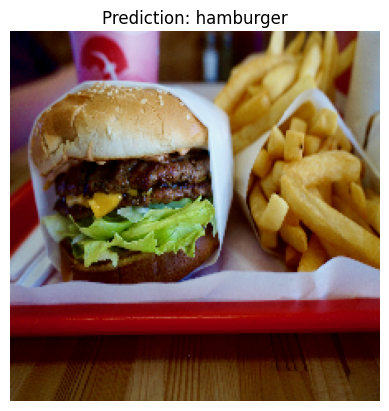

### 9. Formula 1 Sport Historical Data Analytics Project (Data Engineering with Spark and Databricks).
In this project, I analysed the Ergast Formula1 sports database to understand the dominant drivers and dominant teams since the history of the sports. Doing this Data Engineering project enabled me to get proficient with Spark, Databricks, Azure Data Factory and refresh my SQL skill. 
- I used Databricks, Pyspark and SparkSQL in Microsoft Azure environment for the project.
- I wrote Pyspark and SparkSQL scripts to ingest all the data into Azure Datalake Storage Gen2(ADLS) with both full load and incremental loading approaches.
- I wrote Pyspark and SparkSQL transformation scripts to analyse the raw data to gain understanding into most dominant drivers and teams through time.
- I create live Databricks dashboard on top of the SQL analysis workflows for visualization.
- I created three pipelines in the Microsoft Azure Data Factory to automate the data ingestion and transformation processes. 
- I setup triggers in the Data Factory to execute the notebook at scheduled times.
- Some of data ingestion and transformation notebooks are here attached.
1. [**One of the data ingestion notebooks created in Databricks**](https://colab.research.google.com/drive/1B1RyZXKaKAch4rIhT3rrFJgVNtYjS_dI)
2. [**One of the data transformation notebooks created in Databricks**](https://colab.research.google.com/drive/1frDClq001cLnjAs5c0cHbjpnQrLo-xe6)

**The image below shows the Entity Relationship Diagram for the database of the project.**

**The Solution Architecture Designed for the project**
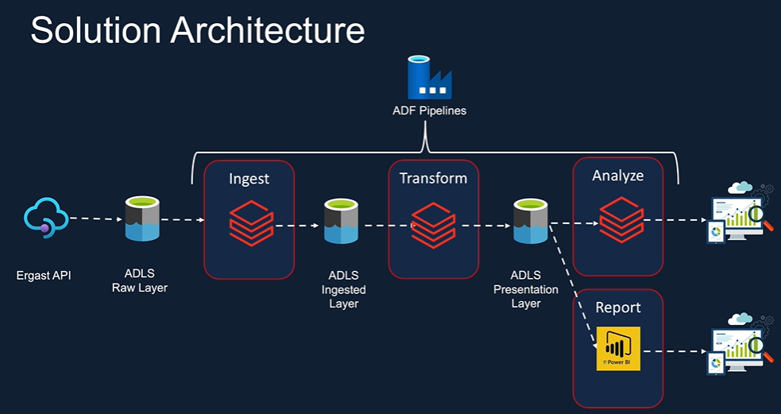
**The image shows the pipeline created in Azure Data Factory to automate the data ingestion workflows**
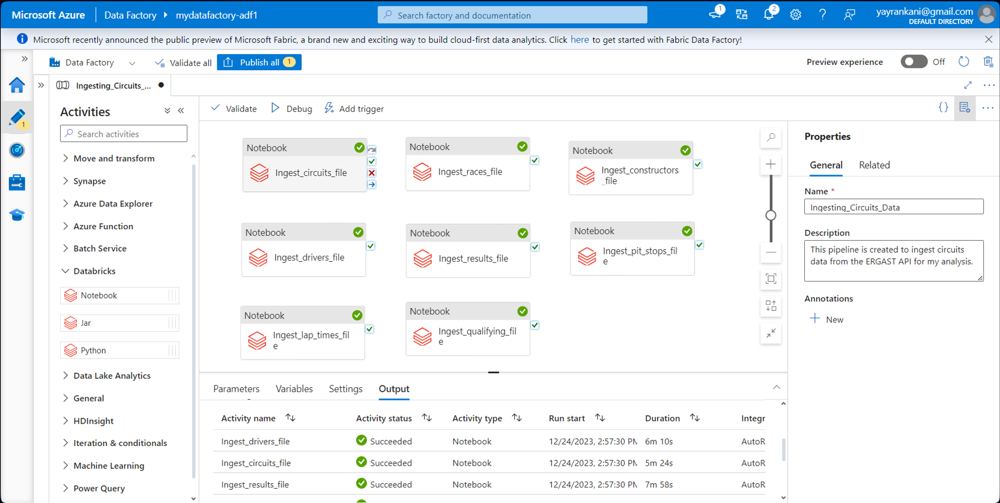
**The image shows the pipeline for automating Data Transformation workflows in Azure Data Factory**
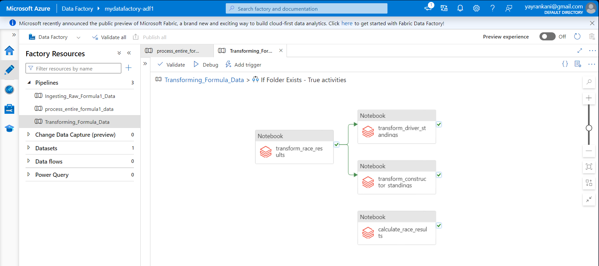
**Snapshot of the Databricks Dashboard Visualizations created on the final analysis results**

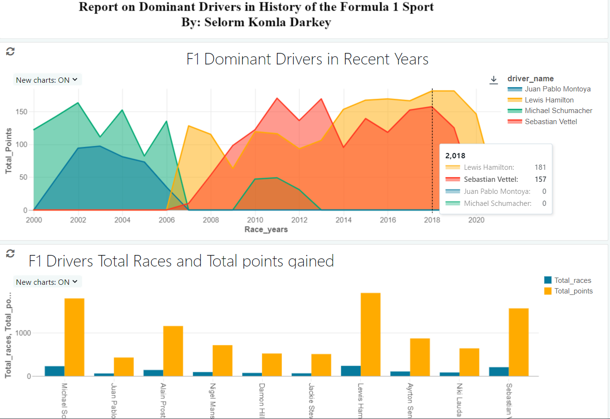.
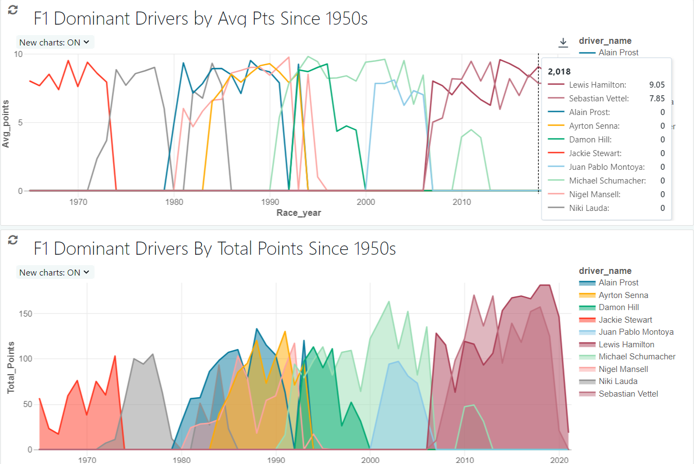.

