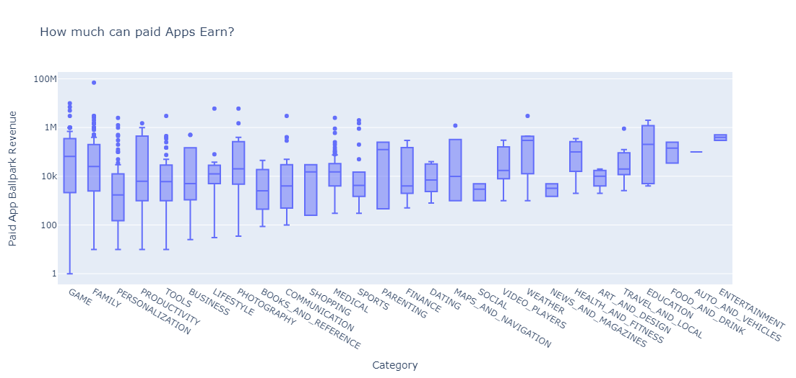
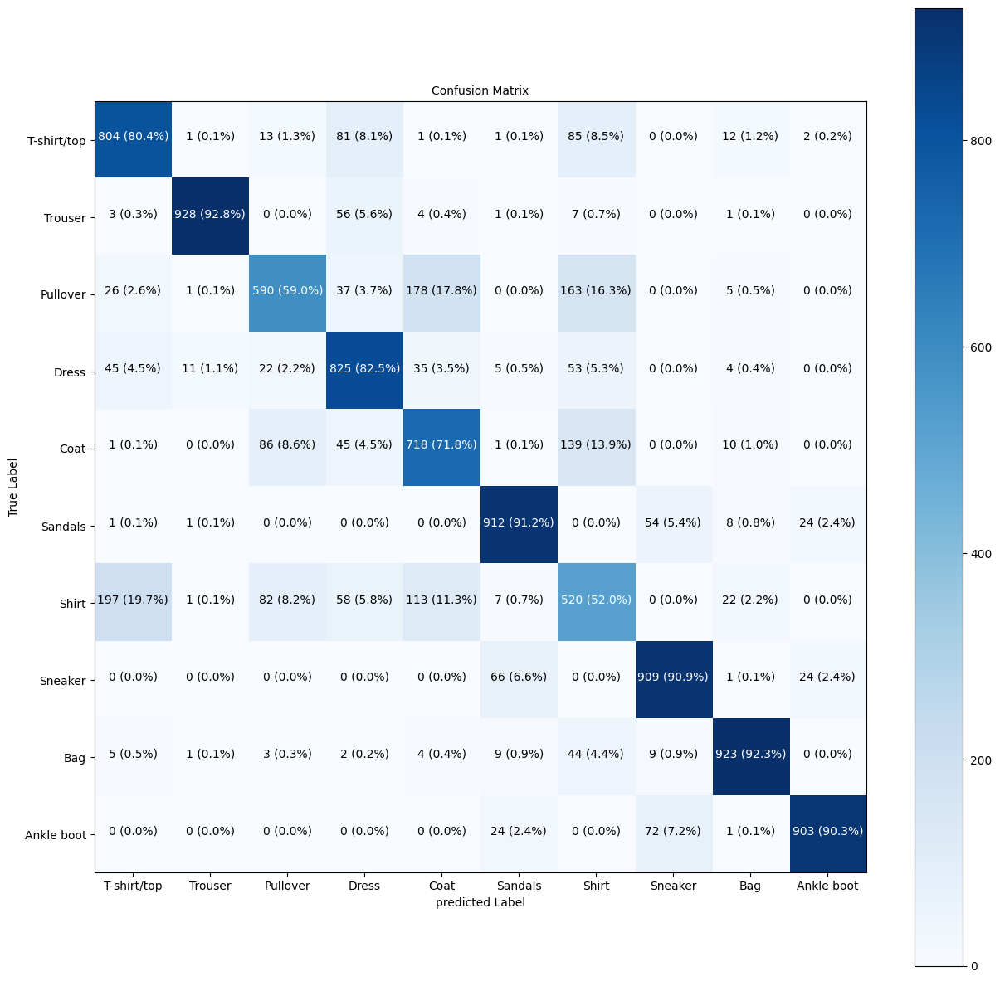

# Data Scientist

## Education
Geoinformatics, MSc - HfT Stuttgart(2022-Present)

### Some Recent Projects:

### 1. Google Play Store App Analytics.
In this project, I did a comprehensive analysis of the Android app market by comparing thousands of apps in the Google Play store. Using Python libraries Pandas and Plotly, I analyzed the app market with the goal of answering the questions:
- which apps have the highest downloads?
- what categories of apps are most downloaded?
- what is the revenue potential for a paid app?
- which categories and content type for paid apps make them sell?
The overall goal is to develop an app pricing mechanism to make data-informed decisions in pricing and categorizing new apps to ensure their success in the Android app market.
[Project Notebook can be seen here](https://colab.research.google.com/drive/1D30kB7bMBgJ77mZqfdnClBh7lHJQi39B)

### 2. House Price Prediction project (Data Science & Machine Learning):
In this project, I used Python libraries Pandas, NumPy, Seaborn, Plotly, Matplotlib, and Scikit-learn to analyze the Boston city house pricing dataset.
- I started with exploratory data analysis.
- Built a regression model to help predict the prices of new homes.
- Used log transform to improve the distribution of the dataset.
- Built the model again which is able to predict with 79% accuracy. 
[**House Price Prediction Notebook**](Boston_House_Prices_Valuation_Model.ipynb). 

### 3. Population Dashboard project (GeoData Analytics & Automation):
In this project, working together in a team of three to produce 3 different dashboards, 
- I used Python to scrape Baden-Wurttemberg population and migration statistic data,
- I used Python to grap OpenStreetMap geo data for Stuttgart City(includes land use data and building footprints).
- Data cleaning and transformation were performed.
- PostgreSQL database was designed to store data.
- The data was analyzed in ArcGIS Pro GIS desktop software,
- A live dashboard was created to visualize the patterns in the data.
- A regression model was used to learn the pattern of population growth and to project the population of Stuttgart City and the Stuttgart administrative area by 2040.
- The workflow was automated to enable any update on the Baden-Wuerttemberg Statistic [**site**](https://www.statistik-bw.de/) to reflect in the dashboard. 
A short video on the project can be seen here. [**Video**](https://youtu.be/H-GCY9xvKJI).

### 4. Clothings Image Classification Project (Deep learning).
Using TensorFlow Deep Learning library and Python, I built neural network image classification models in attempt to classify images of different items of clothings.

- No. of unique classes to classify 10
- Training data : 60,000 images
- Testing data : 10,000 images
- Image Size: 28x28 grayscale images.
- Dataset Source: Tensorflow Fashion MNIST dataset.
  
Brief Summary: I built 3 different neural network classification models and compared their accuracy on the testing data. The best performing model achieved an accurary of 80%. Through the confusion matrix computed, it was observed that images of few classes such as T-shirt and Pullover were the most misclassified since their images tend to look quite familiar.
[**The Notebook can be found here**](Clothings_Image_Recognition_project.ipynb)
A look at the   

### 5. Food Images Classification project (Transfer Learning).
In this project, I build CNN models to classify 10 classes of food. The best results achieved was 41% validation accuracy from three CNN models I built from scratch, even after augmenting the data. So I used Transfer learning feature extraction, where I used Resnet50 and EfficientnetB0 architectures to improve the classification to finally realise a validation accuracy of 91% without overfitting.
Dataset include: 10 classes of food extracted from the Food101 Kaggle dataset.
[**The Notebook can be seen here**](Food_Images_Classfication_10_classes.ipynb)
